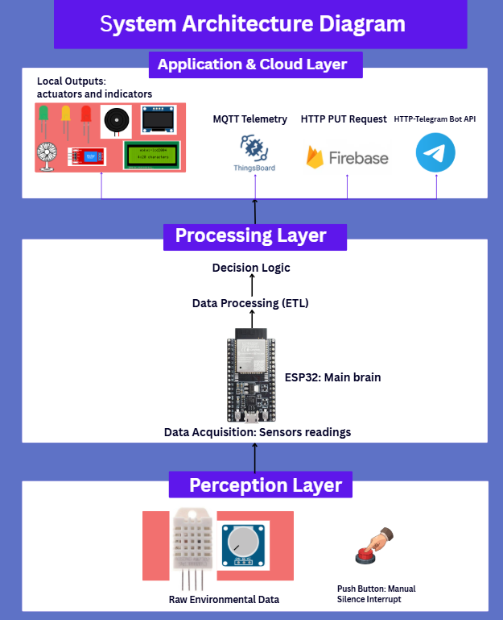
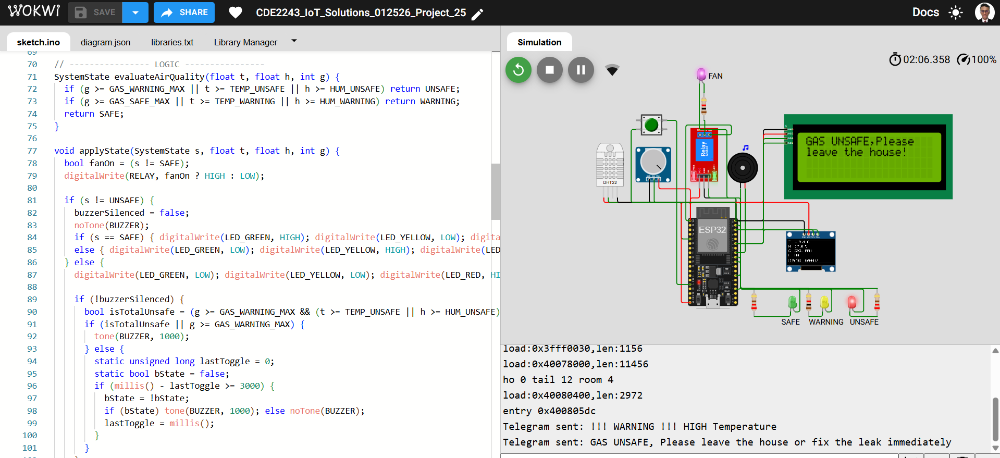

# Smart Air Quality Monitoring System

This project is a high-accuracy **IoT-driven solution** engineered for real-time atmospheric tracking and automated hazard mitigation. By leveraging the **ESP32** platform and cloud-based analytics, the system provides a seamless bridge between physical sensor data and remote decision-making.

The project directly supports the United Nations **Sustainable Development Goals (SDG 11: Sustainable Cities and Communities)** by providing affordable technology that ensures environmental safety and awareness.

---

## 🔗 Project Links
* **Live Dashboard**: [Thingsboard Dashboard](https://thingsboard.cloud/dashboard/ac03abb0f935-11f0-9817-8bc7e0ad4d62?publicId=6cf08b80ff22-11f0-8287-999f1041c10d)
* **Simulation**: [Wokwi Virtual Prototype](https://wokwi.com/projects/454227171978886145)

---

## 🚀 Key Features

* **🌡️ Precision Sensing**: Utilizes a **DHT22 sensor** to capture high-resolution temperature and humidity data.
* **🚨 Dual-Layer Alerting**: Features an on-site **Active Buzzer/LED alarm** for immediate warnings and **Arduino IoT Cloud notifications** for remote monitoring.
* **📱 Local Visualization**: Real-time data streaming to a **128x64 SSD1306 OLED display** for instant status checks without a mobile device.
* **⚙️ Intelligent Automation**: Integrated **Relay module** configured to automatically trigger external ventilation or cooling systems when thresholds are breached.
* **☁️ Cloud Integration**: Full synchronization with **Arduino IoT Cloud** for real-time dashboarding, data logging, and historical trend analysis.

---

## 🛠️ Tech Stack

* **Microcontroller**: ESP32 (WROOM-32)
* **Sensors & Actuators**: DHT22, 5V Relay, Active Buzzer, OLED Display
* **Communication**: Wi-Fi / MQTT Protocol
* **Cloud Infrastructure**: Arduino IoT Cloud & Firebase
* **Programming**: C++ / Arduino Framework

---

## 🧠 System Architecture & Methodology

The system is built on a **Modular Layered Architecture** designed to ensure **99% reliability** in safety-critical communications. 

### **Architectural Layers:**
1.  **Hardware Layer**: Low-level interfacing with sensors (DHT22) and output modules (Relay, Buzzer).
2.  **Core Application Layer**: Logic engine responsible for threshold monitoring and interrupt handling.
3.  **Communication Layer**: Manages secure Wi-Fi handshakes and MQTT data packets for cloud transmission.
4.  **Backend System**: Cloud-based storage and remote dashboard synchronization.

### **Development Workflow:**
The project followed an **Agile / Test-Driven Development (TDD)** approach. Every feature—from the relay trigger to the cloud push—was first simulated and unit-tested to ensure stability before deployment to the physical ESP32 hardware.

---

## ✅ Testing & Quality Assurance

To ensure the system is "production-ready," it underwent rigorous testing phases:
* **Unit Testing**: Verified individual function logic for `DetectObstacles()` and `CalculateRoute()`.
* **Component Testing**: Evaluated the interaction between the sensor inputs and the relay/alarm outputs.
* **Alpha/Beta User Testing**: Conducted with target users to optimize the UI/UX on both the OLED screen and the mobile cloud dashboard.

---

## 📁 Project Visuals

### 🏗️ System Architecture Diagram

### 💻 Wokwi Simulation

---
## Team Members:

* **Abdulrahman  Alamodi**
* **Habiba Hassan Nur Hassan**
* **Mohanad Dalol**
---
